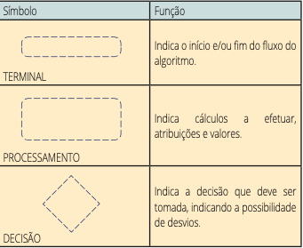
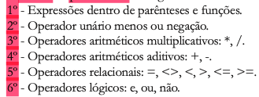
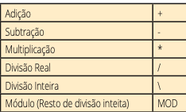
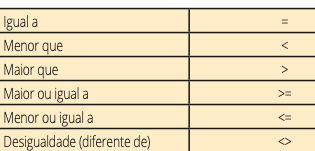
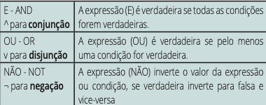
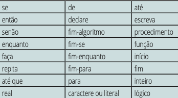

# algorithms
1: Logica
`1.0- Lógica:Conceito e aplicação:` 

1- LOGICA 

E a ciencia do raciocinio e da demonstração, conjunto de leis, principios ou metodos que determinam um raciocinio.

`1.1- Lógica na solução de problemas:` 

Lógica de Programação:

Técnica de encadear pensamentos para atingir determinado objetivo

- Sequência de instruções: definir sequência lógica para resolver problemas, num passo a passo.

`2.0 - Algoritmo: definição e criação por meio da percepção de um problema:`

Criação de um Algorithm:

Seguir um passo a passo → ex:  trocar uma lâmpada, e se ela estiver queimada, executamos um “teste seletivo”

- pegar escada
- trocar lâmpada
- se a lampada n acender, então:
    - subir na escada
    - retirar a velha
    - por a nova

`2.1 - Percepção do Problema` 

Algoritimo e programacao primeira Coisa a se pensar

Nao e a solucao e sim a percepcao do problema, pensamos no problema depois na solucao, e definir a melhor solucao possivel, e sim pode haver mais de uma solucao para o mesmo problema.

Utilizar computador para resolver problema

A primeira coisa e desenvolver um algoritmo, elabora-lo e o passo inicial para solucionar qualquer problema computacional.

Elaboracao de um programa

Resolucao de um problema e programacao, temos o problema ai ele pode ir pelo passo dificil que ir direto para a “Solucao como um programa” ou ir para a (fase da resolucao do problema) na etapa “Solucao em forma de algoritmo” em seguida a fase de implementacao e assim chegamos na “solucao como um programa” de fato.

- Qualquer tarefa q tenha um padrao, pode ser descrita por um Algoritmo, e para montar e simples dividimos em 3 fases fundamentais.
- 3 Fases Fundamentais:
    - Entrada → Processamento → Saida (considere aqui quadrados dashed em cada fase)
        - Entrada: Sao os dados fornecidos inicialmente para criar o Alg.
        - Processamento: E a forma como o problema e resolvido
        - Saida: E a solucao do Problema

2- ALGORITMO
`Algoritmos Estruturados`

1.1 Algoritmos Estruturados

- Facilitar
    - Escrita dos Algoritmos
    - Leitura e Entendimentos dos Algoritmos
    - Manutencao e Modificacao dos Algoritmos
- Reduzir a Complexidade dos Algoritmos
    - Desenvolvimento top-down (refinamento sucessivos)
        - Escrever as funcoes principais do programa, e depois detalhar cada uma delas em funcoes menores, ate o ultimo nivel que nao de mais para detalhar.
        
    - Decompor o Algoritmo todo em modulos funcionais (Modularizacao)
        - Compreender uma solucao, analisando por partes.
    - Usar solucoes simples e nao extencas nos modulos
    

1.2 Principais Tecnicas de Estruturacao dos Algoritmos

- Desenvolvimento Top-Down
    - Entender o problema
    - Formular as alternativas
    - Refinar essas alternativas
        - Detalhar em partes menores ate que se tenha uma visao de todos os detalhes.
- Modularizacao
    
    Dividir a solucao em partes, ou modulos cada um com funcoes bem definidas, dando agilidade ao desenvolvimento.
    
- Estruturas de Controle
    
    Afeta diretamente a qualidade do algoritmo, muitos programadores usam comandos de: 
    
    `desvio incondicional(interrupcao do Algoritmo):`
    
    Ele muda o fluxo de execucao arbitrariamente, usa se quando n tem um dominio da logica do programa, mas tem q se evitar pois provoca quebra da estrutura logica do algoritmo.
    

2.0 Linguagens de Programacao

Escrever um programa e o mesmo que traduzir um algoritmo para uma linguagem de programacao, e elas podem ser: Interpretadas, compiladas ou hibridas.

2.1 Linguagens Interpretadas

O interpretador, le, analise e executa cada instrucao do programa fonte, sem traduzir para uma linguagem de maquina, e tudo executado em sequemcia. Se ocorre um erro, o programa so para.

Desvantagens : Necessita do codigo fonte, o interpretador precisa estar instalado, execucao mais lenta doq as compilada.

2.2 Linguagem Compilada

E traduzir o codigo fonte para linguagem de maquina e executar no proprio computador, aqui ele analisa todo o codigo fonte a procura de erros, so dps e que sera criado um codigo intermediario “codigo objeto”, entao sera linkeditado, em um codigo executavel.

2.3 Linguagens Hibridas

Como o nome ja diz usa Compilada e interpretadas, e a compilacao converte o codigo fonte em codigo bytecode que depois e interpretada. Java por exemplo. q gera JavaBytecode. Devido a isso as hibrida tem mais portabilidade, e sao mais rapidas que uma linguagem interpretada, porque as instrucoes sao projetadas para serem interpretadas facilmente.

2.4 Diagrama de Bloco

Ou diagrama de fluxo, e uma forma de determinar os passos logicos de um processamento. Hj em dia se utiliza pouco, devido a muitas vezes a complexidade de interpretacao, aqui so tem 3, mas existem varios outros: Entrada e Saida de dados, Saida de dados no video, conector, preparacao , linha de comunicacao.

3: Linguagem Algoritmica
1- Portugol 

Linguagem Algoritmica : e uma pseudolinguagem de programacao q utiliza comandos em portugues, e chamamos ela de Portugol conhecida tmb como Portugues estruturado.

Estudantes de Programacao:  Ter a capazidade de definir e usar estruturas ou operacoes compiladas, sem visualizar mt detalhes.

Algoritmos: sao essenciais para elaboracao de programas estruturados.

Vantagem dos Algoritmos: Escrever em portugues, facilita entendimento do programador entender a logica do programa.

2- Tipos de Dados

Numericos(inteiros): Numeros inteiros (negativo,nulo,positivo)

→Portugol: “inteiro”

Numericos (reais): Numeros Reais (negativo,nulo,positivo e fracionario)

→Portugol: “real”

Caracteres: So usar aspas igual a regra das strings, tambem conhecido como alfanumerico, pode ser representado : literal ou cadeia.

→Portugol : “caractere”

Logicos: “verdadeiro” ou “falso”

→Portugol: “logico”

3- Operadores:

Ordem de Procedencia:

Operadores(Aritmeticos): Em divisao Real e Inteira sao o quociente delas, no caso da inteira e um valor inteiro, 5\2 = 2

e se for divisao Real: e o resultado de fato 5/2= 2,5, jo o modulo seria o resto da divisao inteira 5 MOD 2= 1 .

Operadores (relacionais): Relacao entre dois elementos, o resultado sera falso ou verdadeiro sempre.

Operadores (logicos): Estende dos Relacionais, composicoes logicas mais sofisticadas nas expressoes.

4- Constantes:

Definicao: Armazena um valor fixo, eles nao mudam ao decorrer do algoritmo.

- Costantes(numerica):
- Constantes(logica):
- Constante(caracter[literal]):

5- Palavras Reservadas:

Definicao: Sentido Predeterminado, nao podem ser redefinidas.

4- Gramatica do Portugol

1- Definicao e sintaxe geral de um algoritmo

Leland L. Beck : A **gramática de uma
linguagem de programação** é uma descrição formal da
sintaxe, ou forma, dos programas e instruções individuais
escritas nessa linguagem”
Sintaxe: E o nome dado ao conjunto de regras a serem seguidas para a escrita dos Algoritmos, ela esta relacionada a forma de um comando

Semantica: Refere-se ao que e efetuado pelo computador, quando ele encontra um comando, ela esta relacionado ao seu conteudo.

VisuAlg: Intepretador de Algoritmos Segue a Sintaxe:
2-Variaveis e constantes da gramatica do portugol

Variaveis : Armazenam valores, diferente da constante, podem mudar o valor da variavel no algortimo.

variaveis e constantes:  numericas (inteiro ou real), logica ou literal.

2.1- Nomeando constantes e variaveis : (identificadores)

Regras:

1: comecar sempre por uma letra ou simbolo “_” (underline)

2: ter letras ou numericos

3: n pode caracter especiais

4: n pode ter msm nome q as palavras reservadas (comando ja predefinidos)

Nao faz diferenca ser maiuscula ou minuscula os identificadores.

2.2- Declaracao de variaveis

Devem ser declaradas logo no inicio do algoritmo, iniciando com “Var”
3- Comandos basicos

3.1- Atribuicao

Para atribuir um valor a uma variavel usamos (←), como fiz no exemplo acima em SOMA← A + B

3.2- Expressoes

Sao constituidas de constantes, variaveis e operadores.

3.3 Comentarios:

Usa se { } ou //

3.4 Comandos de entrada e saida

Todos algoritmos requer uma, entrada : **leia**  saida: **escreva**

O comando escraval : para saltar uma linha

Entrada: Leia e escreva

Teste de Mesa: 

E seguir instrucoes do algoritmo para verificar se o procedimento utilizado esta correto ou nao.

A va entrar com três variáveis, A e B, fazer as seguintes expressões de soma C=(B+A)+2, B=C*(A+3) e A=(B+C), e escreva o resultado de A, B e C.ntagem e se houver algum erro, podemos detectar rapidamente.